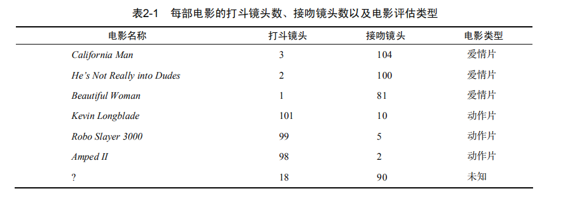
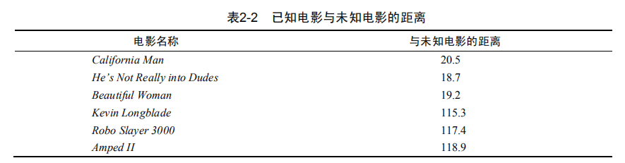
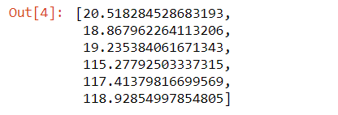
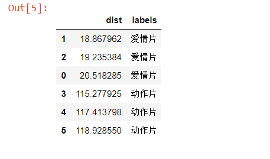
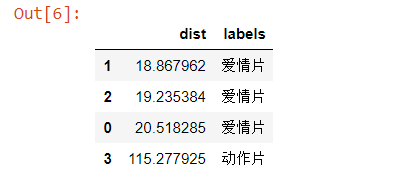
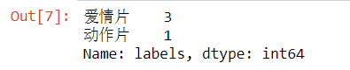

## 本章介绍


本章介绍第一个机器学习算法：K-近邻算法，它非常有效而且易于掌握。首先，我们将探讨K-近邻算法的基本理论，以及如何使用距离测量的方法的方法分类物品；其次我们将使用python从文本文件中导入并解析数据；再次，本章讨论了当存在许多数据来源时，如何避免计算距离时可能碰到的一些常见错误；最后，利用实际的例子讲解如何使用K-近邻算法改进约会网站和手写数字识别系统。

## K-近邻算法概述


机器学习算法K—近邻(KNN)，它的工作原理是：存在一个样本数据集合，也称为训练样本集，并且样本数据集中每个数据都存在标签，即我们知道样本集中每一数据与所属分类的对应关系。输入没有标签的新数据后，将新数据的每个特征与样本集中数据对应的特征进行比较，然后算法提取样本集中特征最相似数据（最近邻）的分类标签。一般来说，我们只选择样本数据集中前K个最相似的数据，这就是K-近邻算法中的K的出处，通常K是不大于20的整数。最后，选择K个最相似数据中出现次数最后的分类，作为新数据的分类。


在这里我们使用电影分类的例子，使用K-近邻算法分类爱情片和动作片。有人曾经统计过很多电影的打斗镜头和接吻镜头。假如有一部未看过的电影，如何确定它是爱情片还是动作片呢？我们可以使用KNN来解决这个问题


首先我们需要知道这个未知电影存在多少个打斗镜头和接吻镜头，具体数字参见表2-1



即使不知道未知电影属于哪种类型，我们也可以通过某种方法计算出来。首先计算未知电影与样本集中其他电影的距离，如表2-2所示。此处暂时不要关心如何计算得到这些距离值。




## K-近邻coding

###  准备数据

```
# 导入pandas库
import pandas as pd
```


```
temp_data= {'电影名称':['California Man', 'He is Not Really into Dudes', 'Beautiful Woman', 'Kevin Longblade', 'Robo Slayer 3000', 'Amped II'],
      '打斗镜头':[3, 2, 1, 101, 99, 98],
      '接吻镜头':[104, 100, 81, 10, 5, 2],
      '电影类型':['爱情片', '爱情片', '爱情片', '动作片', '动作片', '动作片']}
data = pd.DataFrame(temp_data)
data
```


### 计算距离


```
# 假设未知电影的“打斗镜头，接吻镜头”分别为：18, 90
new_data = [18, 90]
diff  = data.iloc[:, 1:3] - new_data
sqDiff = diff**2
sqDistances = sqDiff.sum(1)
temp_distances = sqDistances**0.5
distances = list(temp_distances)
distances
```



### 排序


```
distances_1 = pd.DataFrame({'dist':distances, 'labels':(data.iloc[:6, 3])})
sort_distances = distances_1.sort_values(by = 'dist')
```




### 选取k


```
k = 4 
sort_distances = distances_1.sort_values(by = 'dist')[:4]
sort_distances
```




### 统计出现的频率


```
fre_sort_distances = sort_distances.loc[:, 'labels'].value_counts()
fre_sort_distances
```


```
result = []
result.append(fre_sort_distances.index[0])
result
```


## 实施KNN分类算法

这里首先给出K-近邻算法的伪代码和实际的Python代码，然后详细地解释每行代码的含义。该函数的功能是使用K-近邻算法将每组数据划分到某个类中，其伪代码如下：


对未知类别属性的数据集中的每个点依次执行以下操作：
- 计算已知类别数据集中的点与当前点之间的距离
- 按照距离递增次序排序
- 选取k
- 确定k数目所在类别的出现频率
- 返回k数目出现频率最高的类别作为当前点的预测分类


### 欧式距离

欧式距离，计算两个向量点xA和xB之间的距离

$$d = \sqrt{(xA_0-xB_0)^2+(xA_1-xB_1)^2} $$


### 封装函数


```
def classify0(inx, dataSet, k):
    '''
    函数功能：
        KNN分类器
    参数：
        inx__用于分类的输入向量
        dataSet__输入训练样本集
        K__最近邻居的数目
    '''
    result = []
    diff  = data.iloc[:, 1:3] - new_data
    sqDiff = diff**2
    sqDistances = sqDiff.sum(1)
    temp_distances = sqDistances**0.5
    distances = list(temp_distances)
    distances_1 = pd.DataFrame({'dist':distances, 'labels':(data.iloc[:6, 3])})
    sort_distances = distances_1.sort_values(by = 'dist')
    sort_distances = distances_1.sort_values(by = 'dist')[:k]
    fre_sort_distances = sort_distances.loc[:, 'labels'].value_counts()
    result.append(fre_sort_distances.index[0])
    
    return result
```


