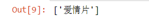
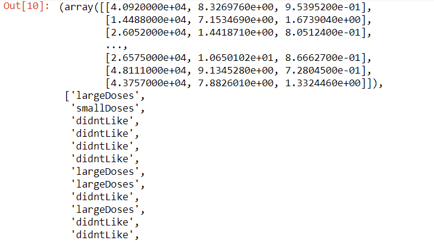
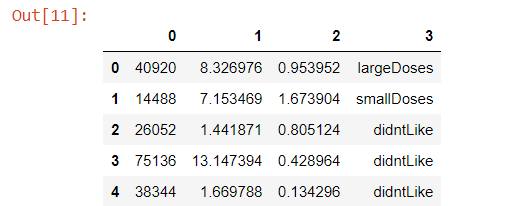
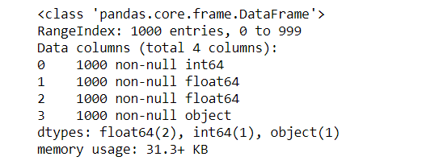
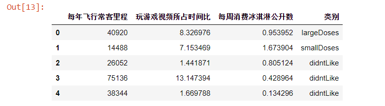
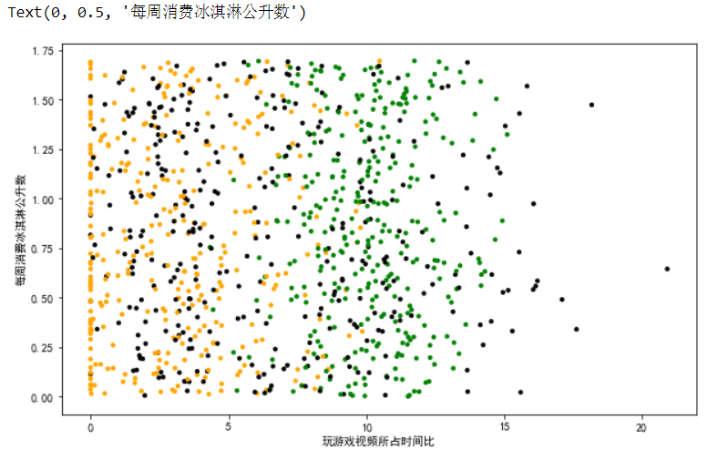
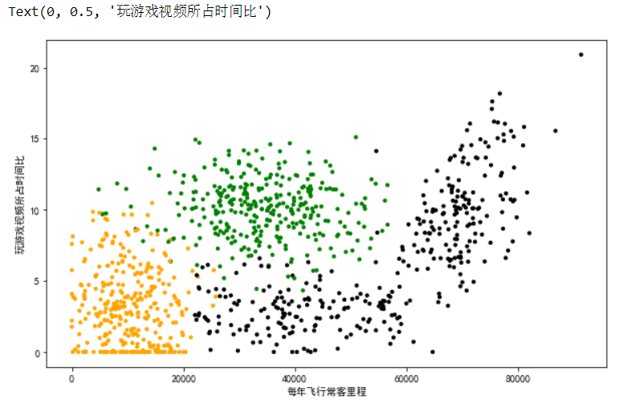
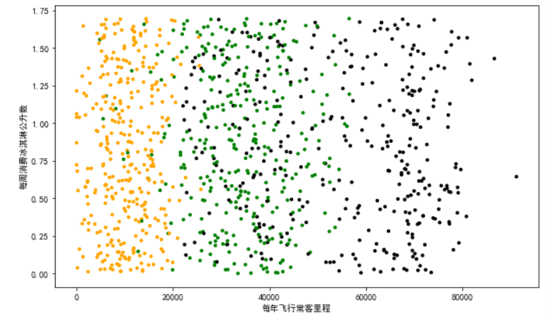
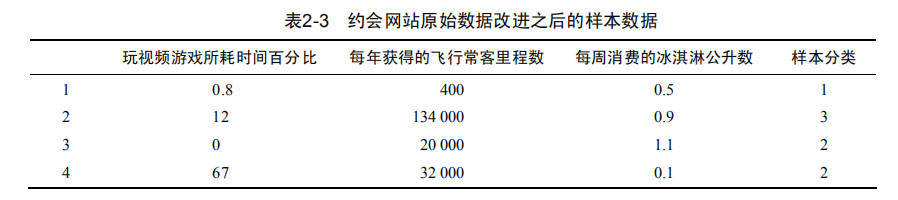
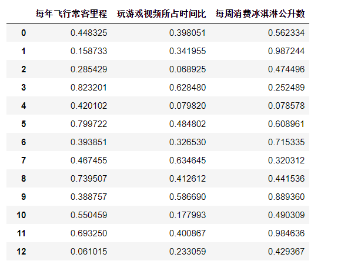

## 本章介绍


本章介绍第一个机器学习算法：K-近邻算法，它非常有效而且易于掌握。首先，我们将探讨K-近邻算法的基本理论，以及如何使用距离测量的方法的方法分类物品；其次我们将使用python从文本文件中导入并解析数据；再次，本章讨论了当存在许多数据来源时，如何避免计算距离时可能碰到的一些常见错误；最后，利用实际的例子讲解如何使用K-近邻算法改进约会网站和手写数字识别系统。

## K-近邻算法概述


机器学习算法K—近邻(KNN)，它的工作原理是：存在一个样本数据集合，也称为训练样本集，并且样本数据集中每个数据都存在标签，即我们知道样本集中每一数据与所属分类的对应关系。输入没有标签的新数据后，将新数据的每个特征与样本集中数据对应的特征进行比较，然后算法提取样本集中特征最相似数据（最近邻）的分类标签。一般来说，我们只选择样本数据集中前K个最相似的数据，这就是K-近邻算法中的K的出处，通常K是不大于20的整数。最后，选择K个最相似数据中出现次数最后的分类，作为新数据的分类。


在这里我们使用电影分类的例子，使用K-近邻算法分类爱情片和动作片。有人曾经统计过很多电影的打斗镜头和接吻镜头。假如有一部未看过的电影，如何确定它是爱情片还是动作片呢？我们可以使用KNN来解决这个问题


首先我们需要知道这个未知电影存在多少个打斗镜头和接吻镜头，具体数字参见表2-1


即使不知道未知电影属于哪种类型，我们也可以通过某种方法计算出来。首先计算未知电影与样本集中其他电影的距离，如表2-2所示。此处暂时不要关心如何计算得到这些距离值。


## K-近邻coding

###  准备数据

```
# 导入pandas库
import pandas as pd
```


```
# 创建字典数据temp_data
temp_data= {'电影名称':['California Man', 'He is Not Really into Dudes', 'Beautiful Woman', 'Kevin Longblade', 'Robo Slayer 3000', 'Amped II'],
      '打斗镜头':[3, 2, 1, 101, 99, 98],
      '接吻镜头':[104, 100, 81, 10, 5, 2],
      '电影类型':['爱情片', '爱情片', '爱情片', '动作片', '动作片', '动作片']}
# 字典数据创建Dataframe
data = pd.DataFrame(temp_data)
data
```


### 计算距离


```
# 假设未知电影的“打斗镜头，接吻镜头”分别为：18, 90
new_data = [18, 90]
# 每一个电影的“打斗镜头，接吻镜头”与新数据的“打斗镜头，接吻镜头”进行相减
diff  = data.iloc[:, 1:3] - new_data
# 相减之后的结果进行平方
sqDiff = diff**2
# 平方之后进行求和(axis=1)
sqDistances = sqDiff.sum(1)
# 求和之后进行开方
temp_distances = sqDistances**0.5
# 将结果转换为list
distances = list(temp_distances)
distances
```


### 排序


```
# 将dist和labels生成Dataframe
distances_1 = pd.DataFrame({'dist':distances, 'labels':(data.iloc[:6, 3])})
# 通过'dist'这一列进行排序
sort_distances = distances_1.sort_values(by = 'dist')
sort_distances
```


### 选取k


```
k = 4
# 选取k=4
sort_distances = distances_1.sort_values(by = 'dist')[:k]
sort_distances
```


### 统计出现的频率


```
# 计算每个不同值有在该列中有多少重复值。
fre_sort_distances = sort_distances.loc[:, 'labels'].value_counts()
fre_sort_distances
```


```
# 创建空list，用于保存
result = []
# 将频率最高的labels添加至result
result.append(fre_sort_distances.index[0])
result
```


## 实施KNN分类算法

这里首先给出K-近邻算法的伪代码和实际的Python代码，然后详细地解释每行代码的含义。该函数的功能是使用K-近邻算法将每组数据划分到某个类中，其伪代码如下：


对未知类别属性的数据集中的每个点依次执行以下操作：
- 计算已知类别数据集中的点与当前点之间的距离
- 按照距离递增次序排序
- 选取k
- 确定k数目所在类别的出现频率
- 返回k数目出现频率最高的类别作为当前点的预测分类


### 欧式距离

欧式距离，计算两个向量点xA和xB之间的距离

$$d = \sqrt{(xA_0-xB_0)^2+(xA_1-xB_1)^2} $$


### 封装函数


```
def classify0(inx, dataSet, k):
    '''
    函数功能：
        KNN分类器
    参数：
        inx__用于分类的输入向量
        dataSet__输入训练样本集
        K__最近邻居的数目
    返回值：
        分类结果
    '''
    # 创建空list，用于保存
    result = []
    # 每一个电影的“打斗镜头，接吻镜头”与新数据的“打斗镜头，接吻镜头”进行相减
    diff  = data.iloc[:, 1:3] - inx
    # 相减之后的结果进行平方
    sqDiff = diff**2
    # 平方之后进行求和(axis=1)
    sqDistances = sqDiff.sum(1)
    # 求和之后进行开方
    temp_distances = sqDistances**0.5
    # 将结果转换为list
    distances = list(temp_distances)
    # 将dist和labels生成Dataframe
    distances_1 = pd.DataFrame({'dist':distances, 'labels':(data.iloc[:6, 3])})
    # 通过'dist'这一列进行排序
    sort_distances = distances_1.sort_values(by = 'dist')
    # 选取k
    sort_distances = distances_1.sort_values(by = 'dist')[:k]
    # 计算每个不同值有在该列中有多少重复值。
    fre_sort_distances = sort_distances.loc[:, 'labels'].value_counts()
    # 将频率最高的labels添加至result
    result.append(fre_sort_distances.index[0])
    
    # 返回result
    return result

# 测试函数
classify0([18, 90], data, 4)
```




## 示例：使用K-近邻算法改进约会网站的配对效果


我的朋友海伦一直使用在线约会网站寻找合适自己的约会对象。尽管约会网站会推荐不同的人选，但她并不喜欢每一个人。经过一番总结，它发现曾交往过三种类型的人
- 不喜欢的人
- 魅力一般的人
- 机具魅力的人


尽管发现了上述规律，但海伦依然无法将约会网站推荐的匹配对象归入恰当的类别。她觉得可以在周一到周五约会那些魅力一般的人，而周末则更喜欢与哪些机具魅力的人为伴。海伦希望我们的分类软件可以更好地帮助她将匹配对象划分到确切的分类中。此海伦还收集了一些约会网站未曾记录的数据信息，她认为这些数据更有助于匹配对象的归类


海伦收集约会数据已经有了一段时间，她把这些数据存入文本文件datingTestSet2.txt中，每个样本数据占据一行，总共有1000行。海伦的样本主要包含以下3种特征：
- 每年获得的飞行常客里乘数
- 玩视频游戏所耗时间百分比
- 每周消费的冰淇淋公升数


### 准备数据：从文本文件中解析数据


```
import numpy as np
def file2matrix(filename):
    '''
    函数功能：
        读取文件
    参数：
        filename__文件名
    返回值：
        返回特征矩阵，标签列表
    '''
    # open() 函数用于打开一个文件，文件名为：filename
    fr = open(filename)
    # readlines() 方法用于读取所有行并返回列表
    arrayOLines = fr.readlines()
    # len()方法返回列表元素个数
    numberOfLines = len(arrayOLines)
    # 创建返回的Numpy矩阵
    returnMat = np.zeros((numberOfLines, 3))
    # 创建标签列表
    classLabelVector = []
    # 初始化index值
    index = 0
    # 遍历每一行数据
    for line in arrayOLines:
        # strip() 方法用于移除字符串头尾指定的字符
        line = line.strip()
        # split() 通过指定分隔符对字符串进行切片(空格)
        listFormLine = line.split('\t')
        # 分割特征矩阵
        returnMat[index, :] = listFormLine[0: 3]
        # 分割标签列表
        classLabelVector.append((listFormLine[-1]))
        index += 1
    # 返回特征矩阵，标签列表
    return returnMat, classLabelVector

# 测试函数     
file2matrix('datingTestSet.txt')
```




```
# 导入数据
datingTest = pd.read_table('datingTestSet.txt', header = None)
datingTest.head()
```




```
# 查看数据信息
datingTest.info()
```




```
# 更正列名
datingTest.columns = ['每年飞行常客里程', '玩游戏视频所占时间比', '每周消费冰淇淋公升数', '类别']
datingTest.head()
```




```
 # 将不同的标签用不同颜色区分(三类)
colors = []
for i in range(datingTest.shape[0]):
    # 位置索引
    m = datingTest.iloc[i, -1]
    if m == 'didntLike':
        colors.append('black')
    if m == 'smallDoses':
        colors.append('orange')
    if m == 'largeDoses':
        colors.append('green')
len(colors)     
```



此散点图使用datingTest数据集中的第一列好第二列数据，分别表示特征值的“玩视频游戏所耗时间百分比”和“每周所消费的冰淇淋的公升数”


```
# 设置中文
plt.rcParams['font.sans-serif']=["Simhei"] 
# 创建画布
plt.figure(figsize=(10, 6))

            # 每年飞行常客里程
plt.scatter(datingTest.iloc[:, 0],
            # 玩游戏视频所占时间比
            datingTest.iloc[:, 1], 
            s = 10,
            c = colors)
plt.xlabel('每年飞行常客里程')
plt.ylabel('玩游戏视频所占时间比')
```



此散点图使用datingTest数据集中的第零列好第一列数据，分别表示特征值的“玩视频游戏所耗时间百分比”和“每年飞行常客里程”


```
# 设置中文
plt.rcParams['font.sans-serif']=["Simhei"] 
# 创建画布
plt.figure(figsize=(10, 6))
            # 每年飞行常客里程
plt.scatter(datingTest.iloc[:, 0],
            # 每周消费冰淇淋公升数
            datingTest.iloc[:, 2], 
            s = 10,
            c = colors)
plt.xlabel('每年飞行常客里程')
plt.ylabel('每周消费冰淇淋公升数')
plt.show()
```



此散点图使用datingTest数据集中的第零列好第二列数据，分别表示特征值的“每周所消费的冰淇淋的公升数”和“每年飞行常客里程

### 准备数据：归一化数值


表2-3给出了提取的四组数据，如果想要计算样本3和样本四之间的距离，可以使用下面的方法


$$\sqrt{(0-67)^2+(20000-32000)^2+(1.1-0.1)^2}$$


我们很容易发现，上面方程中数字差值最大的属性对计算结果的影响最大，也就是说，每年获取的飞行常客里程数对于计算结果的影响将远远大于表2-3中其他两个特征————玩视频游戏所耗时间百分比和每周消费冰淇淋公升数————的影响。而产生这种现象的唯一原因，仅仅是因为飞行常客里程数远大于其他特征值。但海伦认为这三种特征是同等重要的，因此作为三个等权重的特征之一，飞行常客里程数并不应该如此严重地影响到计算结果




处理这种不同取值范围的特征值时，我们通常采用的方法是将数值归一化，如将取值范围处理为0到1或者-1到1之间。下面的公式可以将任意取值范围的特征值转换为0到1区间内的值


$$normlization = \frac{x-Min}{Max - Min}$$


```
def autoNorm(dataSet):
    '''
    函数功能：
        归一化
    参数：
        dataSet__原始数据集
    返回值：
        取值范围为0-1的数据集
    '''
    # 获取特征数组
    data = dataSet.iloc[:, :3]
    # min() 方法可返回指定的数字中带有最小值的数字。
    minVals = data.min()
    # max() 方法可返回指定的数字中带有最大值的数字。
    maxVals = data.max()
    # 归一化公式
    norm = (data - minVals) / (maxVals - minVals)
    return norm

# 测试函数
autoNorm(datingTest)
```
显示部分数据信息




