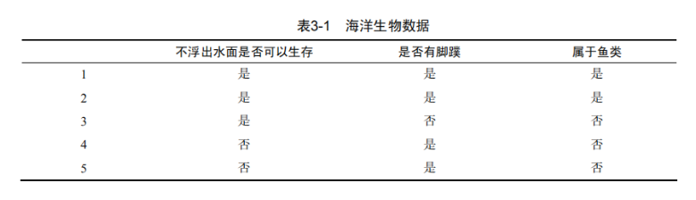
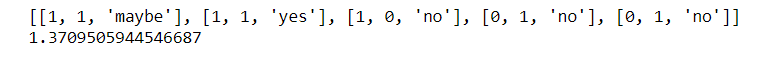
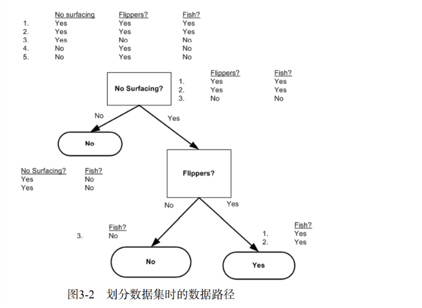

## 本章介绍

本章构造的决策树算法能够读取数据集合，构建类似于图3-1的决策树。决策树的一个重要的任务是为了理解数据中所蕴含的知识信息，因此决策树可以使用不熟悉的数据集合，并从中提取出一系列规则，这些机器根据数据集创建规则的过程，就是机器学习的过程。


接下来我们将学习如何从一堆原始数据中构造决策树。首先我们讨论构造决策树的方法，以及如何编写构造树的Python代码；接着提出一些度量算法成功率的方法，最后我们使用递归建立分类器，并且使用Matplotlib绘制决策树图。构造决策树分类器之后，我们将输入一些隐形眼镜的处方数据，并由决策树分类器预测需要的镜片类型。


表3-1的数据包含5个海洋动物，特征包括：不浮出水面是否可以生存，以及是否有脚蹼。我们可以将这些动物分为两类：鱼类和非鱼类。现在我们想要决定依据第一个特征还是第二个特征划分数据。在回答这个问题之前，我们必须采用量化的方法判断如何划分数据。




### 信息增益

划分数据集的大原则是：将无序的数据变得更加有序。我们可以使用多种方法划分数据集，但是每种方法都有各自的优缺点。组织杂乱无章数据的一种方法就是使用信息论度量信息，信息论是量化处理信息的分支科学。我们可以在划分数据之前或之后使用信息论量化度量信息的内容。

在划分数据集之前之后信息发生的变化称为信息增益，知道计算信息增益，我们就可以计算每个特征值划分数据集获得的信息增益，获得信息增益最高的特征就是最好的选择

$$H=-\sum_{i=1}^{n}p(x_i)log_2p(x_i)$$


### 计算给定数据集的香农熵


```
from math import log
def calchShannonEnt(dataSet):
    '''
    函数功能：计算香农熵
    参数说明：
            dataSet__原始数据集
    函数返回：
            香农熵的值
    '''
    numEntries = len(dataSet)                       # 获取数据的行数
    labelCounts = {}                                # 创建字典，存储数据为，类别：频数
    for featVec in dataSet:                         # 遍历每一行数据
        currentLabel = featVec[-1]                  # 获取每一行数据的最后一个数据
        if currentLabel not in labelCounts.keys():  # 如果currentLabels不在字典中
            labelCounts[currentLabel] = 0              # 将当前的标签存入字典只能怪
        labelCounts[currentLabel] += 1                 # #否则将当前标签对应的键值加1
    
    shannonEnt = 0.0                                # 初始化香农熵
    for key in labelCounts:                         # 遍历数据中每一个类别
        pro = float(labelCounts[key]) / numEntries  # 计算概率
        shannonEnt -= pro * log(pro, 2)             # 计算香农熵
    return shannonEnt                               # 返回香农熵的值
```

### 创建数据集


```
import pandas as pd 
def creatDateSet():
    '''
    函数功能：
            创建数据集
    函数返回：
            数据集
    '''
    dataSet = [[1, 1, 'yes'],                                # 创建数据集              
                [1, 1, 'yes'],
                [1, 0, 'no'],
                [0, 1, 'no'],
                [0, 1, 'no']]
    labels = ['no surfacing', 'flippers', 'labels']          # 两个特征：'no surfacing','flippers'；一个标签'labels'  
    return dataSet                                           # 返回数据集

# 函数测试 
dataSet = creatDateSet()
calchShannonEnt(dataSet)
```


```
dataSet[0][-1] = 'maybe'
print(dataSet)
print(calchShannonEnt(dataSet))
```


需要说明的是，熵越高，那么混合的数据就越多，如果我们在数据集中添加更多的分类，会导致熵结果增大。得到熵之后，我们就可以安装获取最大信息增益的方法划分数据集

### 划分数据集


```
def splitDateSet(dataSet, axis, value):
    '''
    函数功能：
            按照给定特征划分数据集
    参数说明：
            dataSet__原始数据集
            axis__列索引
            value__特征值
    函数返回：
            划分之后的数据集
    '''
    retDataSet = []                                           # 不修改原数据集，创建新的列表对象
    for featVec in dataSet:                                   # 遍历每一行数据
        if featVec[axis] == value:                            # 遍历的值如果等于value
            reducedFeatVec = featVec[:axis]                   #将特征向量的0~axis-1列存入列表reducedFeatVec
            # extend()__将另外一个列表中的元素（以列表中元素为对象），一一添加到当前列表中，构成一个列表
            reducedFeatVec.extend(featVec[axis+1:])           #将特征向量的axis+1~最后一列存入列表reducedFeatVec
            # append()__将另外一个列表（以列表为对象）添加到当前列表中
            retDataSet.append(reducedFeatVec)
    return retDataSet
splitDateSet(dataSet, 0,0)
```


- Python语言在函数中传递的是列表的引用，在函数内部对列表对象的修改，将会会影响该列表对象的整个生存周期。为了消除这个不良影响，我们需要在函数的开始声明一个新列表对象。

- extend()__将另外一个列表中的元素（以列表中元素为对象），一一添加到当前列表中，构成一个列表
- append()__将另外一个列表（以列表为对象）添加到当前列表中

#### 信息增益

$$Gain(D,a)=Ent(D) - \sum_{v=1}^v \frac{D^v}{D}Ent(D^v)$$


```
def chooseBestFeatureToSplit(dataSet):
    '''
    函数功能：选择最好的数据集划分方式
    参数说明：
            dataSet__原本数据集
    函数返回值：
            返回最好的划分数据集的特征
    '''
    numFeatures = len(dataSet[0] - 1)                           # 特征数量(不包含最后一列的特征标签)
    baseEntropy = calchShannonEnt(dataSet)                      # 原始香农熵__未划分的香农熵
    bestInfoGain = 0.0                                          # 初始化信息增益
    bestFeature = -1                                            # 初始化最佳切分列
    for i in range(numFeatures):                                # 遍历数据集中所有的特征
        featList = [example[i] for example in dataSet]          # 使用列表推导式，将特征值放入list中
        uniqueVals = set(featList)                              # 使用set函数去除uniqueVals中重复的元素
        newEntrpy = 0.0                                         # 初始化子节点的香农熵
        for value in uniqueVals:                                # 遍历特征的每一个取值，构建不同的子集
            subDataSet = splitDateSet(dataSet, i, value)        # 使用函数splitDateSet（）获取不同取值的数据集

            pro = len(subDataSet) / float(len(dataSet))         # 公式
            newEntrpy += pro * calchShannonEnt(subDataSet)      # 公式
        
        infoGain = baseEntropy - newEntrpy                      # 公式
        if (infoGain) > bestInfoGain:                           # 比较当前计算的信息增益与保存最大的信息增益
            bestInfoGain = infoGain                             # 保存为最大信息增益
            bestFeature = i                                     # 获取当前最大信息增益的特征i
    return bestFeature                                          # 返回最优特征

# 函数测试
chooseBestFeatureToSplit(dataSet)
```


运行代码告诉我们，第0个特征是最好的用于划分数据集的特征。

本节我们学习了如何度量数据集的信息熵，如何有效地划分数据集下一节，我们将介绍如何将将这些函数功能放在一起，构建决策树。


